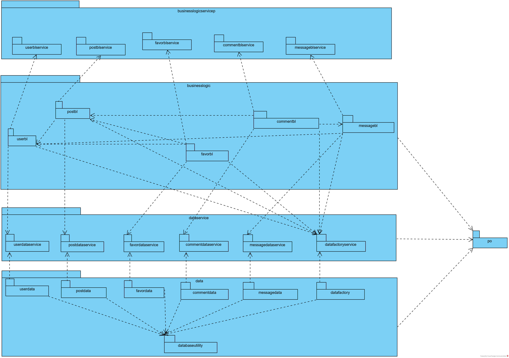

### 组合视角

#### 开发包图

### 接口视角

#### 1 模块职责

|     层     | 职责     |
| :--------: | -------- |
|启动模块|初始化网络通信机制，启动用户界面|
|用户界面层|基于Web的博客系统客户端用户界面|
|业务逻辑层|对用户界面输入进行响应并进行业务处理逻辑|
|数据层|负责数据持久化和数据访问接口|

每一层只使用下方直接接触的层。层与层之间仅通过接口调用完成。

| 接口 | 服务调用方   | 服务提供方       |
| :--------: | ------------ | ---------------- |
|UserBLService|服务器用户界面层|服务器业务逻辑层|
|PostBLService|||
|FavorBLService|||
|CommentBLService|||
|MessageBLService|||
|UserDataService|服务器业务逻辑层|服务器数据层|
|PostDataService|||
|FavorDataService|||
|CommentDataService|||
|MessageDataService|||

借用博客查找来说明层之间的调用。每一层都是由上层依赖了一个接口（需接口）而下层实现这个接口（供接口）。这样的实现大大降低了层与层之间的耦合。

#### 2 用户界面层分解
系统存在9个用户界面：登录界面、个人中心界面、客户主界面、查看个人信息界面、收藏界面、消息界面、搜索界面、编辑文章界面、我的博客界面

##### 2.1 职责

|模块|职责|
|:---:|---|
|MainFrame| 界面Frame；负责界面的显示和界面的跳转|

##### 2.2 接口规范

| MainFrame | 语法   |init(args:String[])|
| ------ | :-----------|---|
|        | **前置条件** |**无**|
|        | **后置条件** |**显示Frame以及LoginPanel**|

|         服务名         | 服务                   |
| :--------------------: | ---------------------- |
| blservice.LoginService | 登录界面的业务逻辑接口 |
|blservice.*BLService|每个界面都有一个相应的业务逻辑接口|

#### 3 业务逻辑层分解

##### 3.1  职责
|     模块     | 职责     |
| :--------: | -------- |
|UserBLService| 负责实现对应与登录注册界面所需要的服务 |
|PostBLService|负责实现对应与我的博客界面所需要的服务|
|FavorBLService|负责实现对应与收藏界面所需要的服务|
|CommentBLService|负责实现对应与消息界面所需要的服务|
|MessageBLService|负责实现对应与消息界面所需要的服务|

##### 3.2 接口规范

UserBLService的接口规范

|    提供的服务（供接口）||  |
| :--------: |------|------------------|
|  UserService.login  | 语法  |Public User login|
||   前置条件    | password符合输入规则  |
||后置条件| 查找是否存在对应的user，根据输入的password返回登录验证的结果  |

|    需要的服务（需接口）|  |
| :--------: |------------------|
|User getUserInfo|获取user数据库的用户信息的引用|
|ResponseVO registerAccount|在user数据库中插入一个新的user对象|
|ResponseVO updateUserInfo|在user数据库中更新一个旧的user对象|

PostBLService的接口规范

|    需要的服务（需接口）|  |
| :--------: |------------------|
|List<Blog> getBlogsByQuery|得到数据库的全部博客信息的引用|
|Blog getBlogByBlogId|得到数据库的指定id的博客信息的引用|

FavorBLService的接口规范

|    提供的服务（供接口）||  |
| :--------: |------|------------------|
|FavorService.putFavor|语法|public ResponseVO putFavor|
||前置条件|开启一个收藏任务|
||后置条件|将目标文章添加进收藏列表|
|FavorService.putFavorFolder|语法|public ResponseVO putFavorFolder|
||前置条件|开启一个收藏夹添加任务|
||后置条件|在收藏界面新增一个收藏夹|
|FavorService.deleteFavorFolder|语法|public ResponseVO deleteFavorFolder|
||前置条件|开启一个收藏夹删除任务|
||后置条件|在收藏界面删除一个指定的收藏夹|

|    需要的服务（需接口）|  |
| :--------: |------------------|
|List<BlogInfoVO> getFavorsByUserId|得到数据库内全部收藏信息的引用|

CommentBLService的接口规范

|    提供的服务（供接口）||  |
| :--------: |------|------------------|
|CommentService.putComment|语法|public  ResponseVO putComment|
||前置条件|开启一个评论添加任务|
||后置条件|添加并发表评论至评论区|

|    需要的服务（需接口）|  |
| :--------: |------------------|
|List<Comments> getCommentByBlogID|列表式展现得到的数据库的某个博客的全部评论信息的引用||

#### 4 数据层分解

#####4.1 职责
|     模块     | 职责     |
| :--------: | -------- |
| data | 持久化数据库的接口，提供集体载入，集体保存，增删改查服务 |
| user | 基于data的持久化数据库的接口，保存和user有关的数据 |
| blog | 基于data的持久化数据库的接口，保存和blog有关的数据  |
| comment | 基于data的持久化数据库的接口，保存和comment有关的数据  |
| message | 基于data的持久化数据库的接口，保存和message有关的数据  |
| Favor | 基于data的持久化数据库的接口，保存和Favor有关的数据  |

##### 4.2 接口规范
| 提供的服务(供接口) |  |   |
| :--------: |------|------------------|
|data.insert|语法|public void insert(data d)|
|  |前置条件| 同样ID的data在在mapper中不存在|
|  |后置条件|在数据库中增加一个data记录|
|data.delete|语法|public void delete(data d)|
|  |前置条件|同样ID的data在在数据库中存在|
|  |后置条件|删除一个data|
|data.update|语法|public void update(data d)|
|  |前置条件|同样ID的data在在数据库中存在|
|  |后置条件|更新一个data|
|data.find|语法|public data insert(long id)|
|  |前置条件|无|
|  |后置条件|按ID进行查找返回相应的data结果|
|data.init|语法|public void init()|
|  |前置条件|无|
|  |后置条件|初始化持久数据库|

#### 用户界面跳转

### 信息视角
#### 数据持久化对象
#### 数据库表
